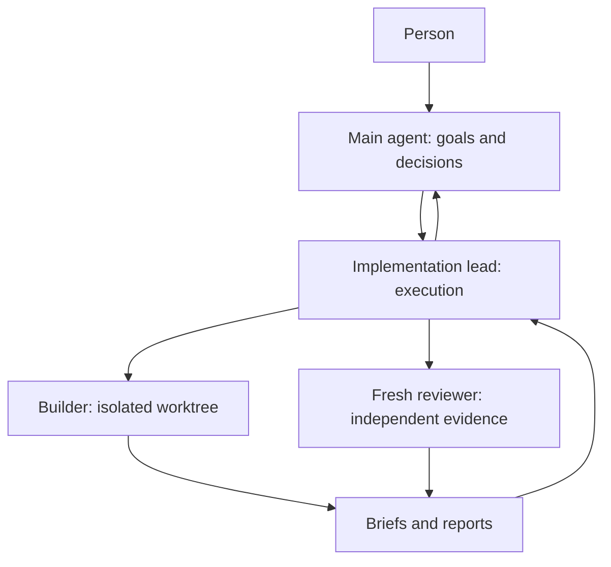

# Herdr workspace

A portable version of a working multi-agent setup: a main agent for the person,
one implementation lead for execution, builders in isolated Git worktrees, and
fresh independent reviewers. A small Markdown workspace keeps decisions and
handoffs recoverable when sessions end or compact.

This is a workflow kit, not Herdr itself. It contains generic role instructions,
templates and two dependency-free Python helpers. It does not include personal
accounts, credentials, project code, company rules, session histories or data.

For teammates, start with the setup below. The portable kit lives in
`workspace-template/`; the root-level role and agent directories are a separate
personal snapshot and are **not** copied into new workspaces.

## Start here

Use macOS, Linux, or a Linux environment in WSL with Python 3.9+, Git, Herdr,
Codex CLI, Claude Code and optionally GitHub CLI. The helpers target POSIX
environments; native Windows has not been verified.

1. Install the tools from their official guides:
   [Herdr](https://herdr.dev/docs),
   [Codex CLI](https://developers.openai.com/codex/cli/),
   [Claude Code](https://code.claude.com/docs/en/setup),
   [GitHub CLI](https://cli.github.com/).
2. Sign in with **your own accounts**: run `codex login`, start `claude` and
   complete its sign-in, and use `gh auth login` if you want GitHub integration.
3. Clone this repo and create a separate workspace:

   ```bash
   gh repo clone DylanHallahan/herdr-workspace
   cd herdr-workspace
   python3 scripts/init.py "$HOME/agent-workspace"
   ```

4. Inspect `~/agent-workspace/POLICY.md`. It contains the workflow choices you
   should tailor before using this with real projects.
5. Start a Herdr session:

   ```bash
   herdr --session agents
   ```

6. In a shell pane inside that session, launch the main agent. Substitute a model
   available to your account; model names are deliberately not pinned in this kit.

   ```bash
   python3 /path/to/herdr-workspace/scripts/launch.py lead \
     --workspace "$HOME/agent-workspace" --model YOUR_CODEX_MODEL
   ```

The launcher creates a named agent in a new background tab. Open that tab and
tell the main agent what you want done, which project checkout to use, and what
actions you authorize. No project is assigned automatically.

For substantial work, start the implementation lead the same way:

```bash
python3 /path/to/herdr-workspace/scripts/launch.py implementation-lead \
  --workspace "$HOME/agent-workspace" --model YOUR_CLAUDE_MODEL
```

Give the main agent this starting instruction:

> Read your role instructions and the workspace policy. Work directly with me.
> Use the existing implementation-lead for the execution of substantial tasks.
> Record an explicit assignment before delegating. My project is at [absolute
> checkout path]. The first outcome I want is [outcome].

## How the pieces fit



One implementation lead coordinates the assigned queue. Builders do not create
more agents. The reviewer receives a source-first brief instead of the builder's
conversation. The main agent sees outcomes and real decisions, not every status
transition. For small tasks, the main agent can work directly.

Read [the workflow](docs/workflow.md) for a complete handoff and
[launching and recovery](docs/launching.md) for worker commands, permissions,
layout and reconnecting. The templates include a brief, report and project note.

## What gets installed

`scripts/init.py` copies **only** the bundled `workspace-template/` into a new
directory. It refuses an existing destination, does not install software, does
not read your live configuration, and does not change `~/.codex`, `~/.claude`,
Herdr settings, shell startup files or crontab. Keep private working notes in the
generated workspace, outside this shareable repository.

```text
agent-workspace/
  POLICY.md                  Human-owned defaults and authorization boundaries
  PLAYBOOK.md                Shared execution and evidence rules
  roles/                     Main, implementation lead, builder, reviewer
  lead-agent/                Codex entry instructions
  implementation-lead/       Claude entry instructions
  vault/
    Bridge.md                Current overview
    Board.md                 Project index
    Implementation-queue.md  Execution and shared-resource coordination
    projects/                One current-state note per project
    briefs/                  Explicit assignments
    reports/                 Evidence and handoffs
    templates/               Blank reusable documents
```

Open `vault/` in Obsidian if you use it; any Markdown editor works. There are no
required Obsidian plugins, databases or cloud services.

## Which instructions does an agent read?

In a generated workspace, `POLICY.md` defines scope and authorization, while
`PLAYBOOK.md` defines the shared execution, review and reporting workflow.
`roles/` assigns responsibilities to each kind of agent. The `AGENTS.md` and
`CLAUDE.md` files in the lead directories are small entry points that tell the
agent which of those files to read.

The launcher gives builders and reviewers an explicit role, workspace policy,
playbook and assignment brief while keeping their working directory in the
project checkout. That project’s own instructions still apply. Vault notes
record current state and evidence; they do not assign a new project by themselves.

## Add team messaging with RainCLI

Once your workspace and agents are running, follow the
[RainCLI teammate setup guide](https://github.com/DylanHallahan/raincli/blob/main/SETUP.md).
You need a personal invitation to join your team, choose your own password, and
register an agent identity. The guide installs the CLI and skill, creates a
dedicated inbox workspace, and connects that inbox to Herdr.

RainCLI carries messages and Markdown attachments between teammates over HTTPS.
Each person keeps their own vault; only explicitly approved context is available
to the inbox. The connector must remain running to deliver messages into Herdr;
automatic startup is not provided. This starter does not create accounts, copy
credentials, or start a connector.

## Models and permissions

The original pattern uses Codex for the main agent and independent review, and
Claude for implementation leadership and coding. Choose model IDs and effort
levels your subscriptions support. The launcher requires `--model`, accepts
optional `--effort`, and does not copy someone else's runtime profile.

Normal CLI approval behavior is the default. For the unattended permissions used
by the original setup, the launcher supports explicit `--bypass`; see
[the exact flags](docs/launching.md#permissions). Role instructions still limit
what the agent is authorized to do. Bypass disables technical permission checks.

## Sharing and updates

Share this public repository, then have the recipient initialize their own
workspace and authenticate locally. No collaborator invitations are sent by
these scripts.

Pulling updates changes the kit, not a workspace already generated from it.
Compare updated templates with your working copies before adopting them; rerun
the initializer into a new directory if you want a clean comparison.

## Verification

The kit was prepared against Herdr 0.9.1 on Linux. Helpers are checked using a
temporary workspace and a stub Herdr CLI; this does not prove another machine's
authentication, model availability or live agent startup. The scripts use the
installed CLI's documented interfaces. Check `herdr --help`, `codex --help` and
`claude --help` if your versions differ. See [validation notes](docs/validation.md).

## Personal snapshot and provenance

The root `POLICY.md`, `PLAYBOOK.md`, `roles/`, `lead-agent/`,
`implementation-lead/` and `inbox-agent/` preserve the original personal workspace
snapshot. They refer to the owner’s paths and operational state. Do not copy them
over the portable templates for teammate setup. In particular, `lead-agent/resume.sh`
uses the owner's local settings and bypasses approval/sandbox prompts.

The live personal workspace remains `~/herdr`; updating this repository does not
update it or any generated workspace. The portable kit was imported from
`dhallahan-orion/herdr-workflow-starter` revision
`fe5720c34d219833cd7e0a91ba3715cfa19b0fd5` (September 22, 2026). Its MIT license
is preserved in [docs/starter-LICENSE.txt](docs/starter-LICENSE.txt) and applies
to the imported starter scripts, templates and documentation; it does not
change the licensing of the pre-existing personal snapshot.
